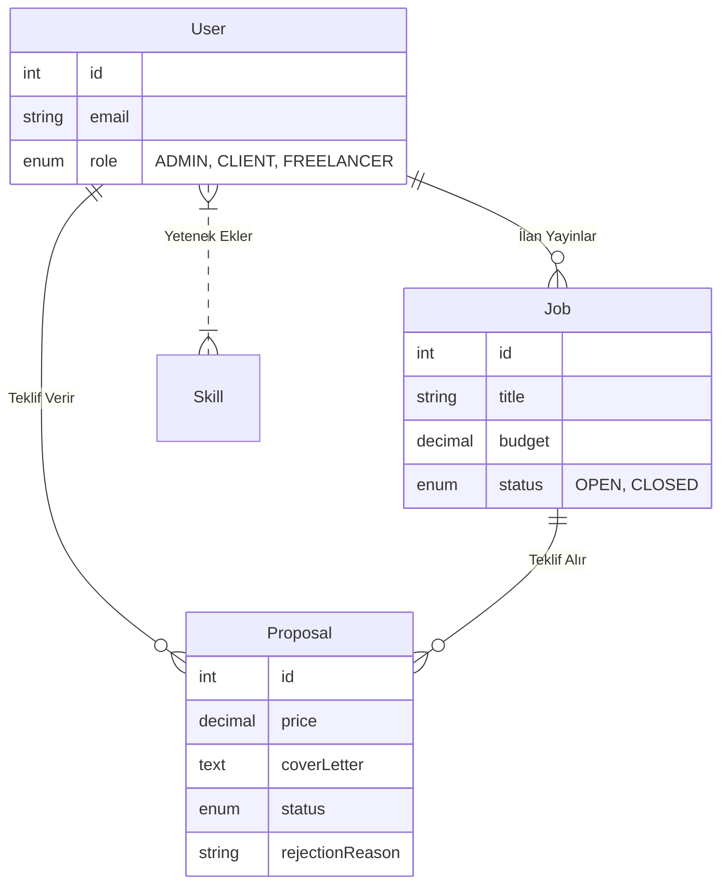

# CENG 307 - Freelance İş Platformu (Marketplace) Proje Raporu

**Hazırlayan:** Hasan Toğmuş
**Tarih:** 02.01.2026

---

## 1. Proje Dağıtımı ve Erişim (Deployment)
Proje, her yerden erişilebilir olması amacıyla bulut sunuculara yüklenmiştir.

*   **Web Uygulaması (Frontend):** [https://freelance-marketplace-platform-chi.vercel.app](https://freelance-marketplace-platform-chi.vercel.app)
*   **API Sunucusu (Backend):** [https://freelance-marketplace-platform-j8m2.onrender.com](https://freelance-marketplace-platform-j8m2.onrender.com)

---

## 2. Proje Geliştirme Süreci (Nasıl Yapıldı?)
Bu proje, modern bir "Full Stack" web uygulaması geliştirme döngüsü izlenerek sıfırdan inşa edilmiştir. Geliştirme süreci şu aşamalardan oluşmuştur:

1.  **Gereksinim Analizi ve Veritabanı Tasarımı:**
    İlk olarak sistemin ihtiyaç duyduğu temel varlıklar (Kullanıcı, İlan, Teklif, Yetenek) belirlenmiş ve bunlar arasındaki ilişkiler (Örn: Bir kullanıcı birden fazla ilan açabilir) kağıt üzerinde tasarlanmıştır.

2.  **Geliştirme Ortamının Kurulumu:**
    Proje için **Node.js** tabanlı bir altyapı seçilmiştir. Backend için **NestJS** framework'ü, Frontend için ise **React (Vite)** kütüphanesi tercih edilmiştir. Versiyon kontrolü için **Git** kullanılmış ve proje GitHub üzerinde barındırılmıştır.

3.  **Backend (API) Geliştirme:**
    *   Veritabanı bağlantısı için **TypeORM** ve **SQLite** kullanılarak tablolar otomatik oluşturulmuştur.
    *   Güvenlik için **JWT (JSON Web Token)** tabanlı bir kimlik doğrulama mekanizması kurulmuştur.
    *   İşverenlerin ilan açması, freelancerların teklif vermesi ve adminin yönetimi için gerekli RESTful servisler yazılmıştır.

4.  **Frontend (Arayüz) Geliştirme:**
    *   Kullanıcı dostu bir arayüz için **TailwindCSS** framework'ü kullanılmıştır.
    *   Sayfalar arası geçiş için **React Router** entegre edilmiştir.
    *   Backend ile haberleşmek için **Axios** kütüphanesi kullanılarak veriler dinamik hale getirilmiştir.

5.  **Test ve Yayına Alma (Deployment):**
    Proje tamamlandıktan sonra Backend **Render.com** üzerine, Frontend ise **Vercel** üzerine yüklenerek canlı kullanıma açılmıştır.

---

## 3. Backend Endpoint Analizi
Backend sistemi, istemcilerin (Frontend) veri alışverişi yapabilmesi için aşağıdaki uç noktaları (endpoints) sunmaktadır:

### Kimlik Doğrulama (Auth Modülü)
*   **POST /auth/register:** Formdan gelen verilerle yeni bir kullanıcı kaydı oluşturur. Şifreleri güvenli bir şekilde hashler.
*   **POST /auth/login:** Kullanıcı bilgilerini doğrular ve sisteme giriş yapması için bir erişim anahtarı (Token) döner.
*   **GET /auth/profile:** Token sahibinin kimlik bilgilerini getirir.

### İş İlanları (Jobs Modülü)
*   **POST /jobs:** İşverenin belirlediği kriterlerde (Bütçe, Kategori, Seviye) yeni bir ilan kaydeder.
*   **GET /jobs:** Veritabanındaki tüm açık ilanları, işveren bilgisiyle beraber listeler.
*   **GET /jobs/:id:** Tek bir ilanın başlığını, açıklamasını ve ona gelen teklifleri detaylı getirir.
*   **PATCH /jobs/:id:** İlan sahibinin ilanı güncellemesine izin verir.
*   **DELETE /jobs/:id:** İlanı ve ona bağlı tüm teklifleri sistemden kalıcı olarak siler.

### Teklifler (Proposals Modülü)
*   **POST /proposals:** Freelancer'ın bir ilana fiyat ve ön yazı ile başvurmasını sağlar.
*   **GET /proposals/me:** Freelancer'ın geçmişte yaptığı tüm başvuruları listeler.
*   **GET /proposals/admin/all:** (Sadece Admin) Sistemdeki istisnasız tüm teklifleri raporlar.
*   **POST /proposals/:id/accept:** İşverenin bir teklifi onaylamasını sağlar ve durumu "ACCEPTED" yapar.
*   **PATCH /proposals/:id/reject:** İşverenin bir teklifi reddetmesini ve red nedenini kaydetmesini sağlar.

### Kullanıcılar (Users Modülü)
*   **PATCH /users/profile:** Kullanıcının biyografisini ve yeteneklerini güncellemesini sağlar.
*   **GET /users:** (Sadece Admin) Kayıtlı tüm kullanıcıları listeler.
*   **DELETE /users/:id:** (Sadece Admin) Bir kullanıcıyı yasaklar ve tüm verilerini siler.

---

## 4. Frontend Bileşen Analizi (Components)
Arayüz tasarımı, yönetilebilirliği artırmak adına aşağıdaki bileşenlere ayrılmıştır:

### Sayfa Bileşenleri (Pages)
*   **Landing.tsx:** Ziyaretçiyi karşılayan, "Hemen Başla" butonları içeren tanıtım sayfasıdır.
*   **Login.tsx & Register.tsx:** Kullanıcıdan giriş/kayıt verilerini alan form sayfalarıdır.
*   **Dashboard.tsx:** Kullanıcının rolüne özel (İşveren için İlanlarım, Freelancer için Özet) içerik sunan ana paneledir.
*   **JobListing.tsx:** Tüm ilanların kartlar halinde listelendiği, arama ve filtreleme yapılan sayfadır.
*   **JobDetail.tsx:** İlanın tam metninin okunduğu, işverenin teklifleri yönettiği, freelancerın teklif formu doldurduğu en kapsamlı sayfadır.
*   **Proposals.tsx:** Freelancer'ın kendi tekliflerinin durumunu (Bekliyor/Onaylandı) takip ettiği sayfadır.
*   **Profile.tsx:** Kullanıcının yetenek ekleyip çıkardığı profil sayfasıdır.
*   **AdminDashboard.tsx:** Yöneticilerin kullanıcı ve teklif trafiğini izlediği, silme işlemlerini yaptığı özel kontrol panelidir.

### Ortak ve UI Bileşenleri (Shared & UI Components)
*   **Layout.tsx:** Uygulamanın iskeletidir. Üst başlık (Header) ve Yan Menüyü (Sidebar) barındırır. Sayfa içeriğini (Outlet) bu iskeletin içine yerleştirir.
*   **Button.tsx:** Proje genelinde kullanılan, farklı renk (Primary/Destructive/Outline) ve boyut seçenekleri sunan standart buton bileşenidir.
*   **Input.tsx:** Formlarda kullanılan, tutarlı tasarıma sahip metin giriş kutusudur.

---

## 5. Veritabanı Tasarımı (ER Diyagramı)
Veritabanı ilişkileri aşağıdaki gibi kurgulanmıştır:

*   **User (Kullanıcı):** Sistemin merkezindedir. `role` alanı kullanıcının yetkisini belirler.
*   **Job (İlan):** Bir kullanıcıya (`client`) bağlıdır. Bir ilana birden çok teklif gelebilir.
*   **Proposal (Teklif):** Bir ilana (`job`) ve bir kullanıcıya (`freelancer`) bağlıdır. Ara tablodur.
*   **Skill (Yetenek):** Kullanıcılarla Çoktan-Çoğa (Many-to-Many) ilişkiye sahiptir.

*(Not: Bu diyagram Markdown uyumlu görüntüleyicilerde şema olarak görünür.)*

---

## 6. Proje Görselleri

### 6.1. Giriş ve Kayıt Ekranı
Kullanıcılar sisteme Freelancer, İşveren veya Yönetici olarak kayıt olabilirler.

### 6.2. İlan Verme ve Detaylar
İşverenler, ihtiyaç duydukları proje için detaylı bir ilan oluşturabilirler.

### 6.3. Teklif Verme (Freelancer Arayüzü)
Freelancerlar, ilan detaylarını inceleyip kendi fiyat ve açıklamalarıyla teklif sunabilirler.

### 6.4. Admin Paneli (Kullanıcı Yönetimi)
Admin, sistemdeki tüm kullanıcıları listeleyebilir, rollerini görebilir ve gerektiğinde hesaplarını silebilir.

### 6.5. Profil Yönetimi
Kullanıcılar kendi profillerini görüntüleyebilir ve yeteneklerini düzenleyebilirler.

