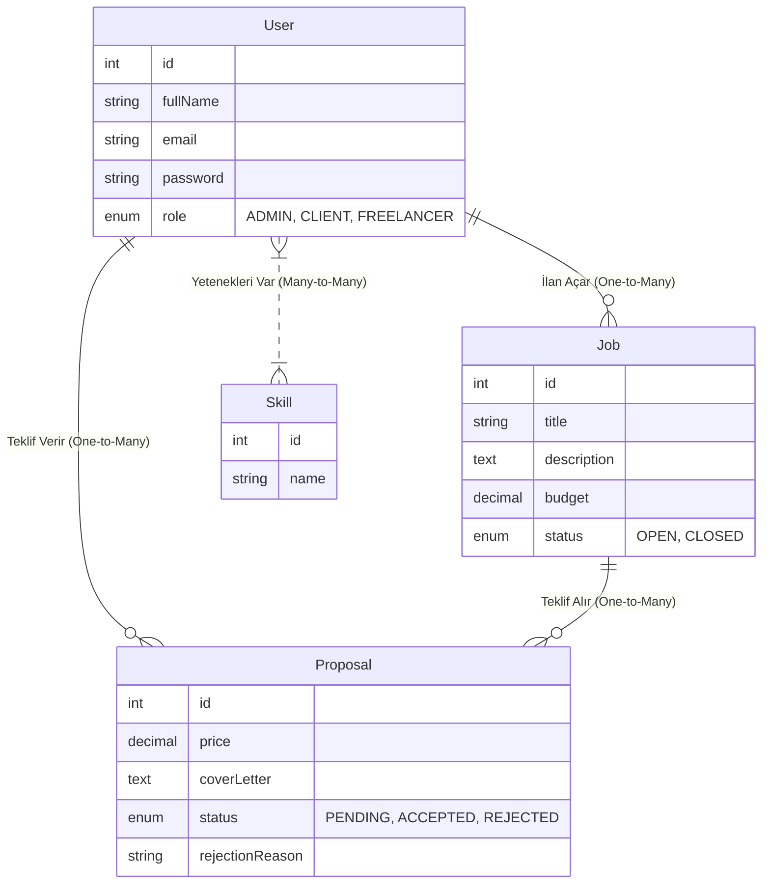

# CENG 307 - Freelance İş Platformu (Marketplace) Proje Raporu

**Hazırlayan:** Hasan Toğmuş
**Tarih:** 02.01.2026

---

## 1. Proje Dağıtımı (Deployment)
Proje, modern bulut teknolojileri kullanılarak canlı ortama alınmıştır ve aşağıdaki adreslerden erişilebilir durumdadır:

*   **Web Uygulaması (Frontend):** [https://freelance-marketplace-platform-chi.vercel.app](https://freelance-marketplace-platform-chi.vercel.app)
*   **API Sunucusu (Backend):** [https://freelance-marketplace-platform-j8m2.onrender.com](https://freelance-marketplace-platform-j8m2.onrender.com)

---

## 2. Backend Geliştirme ve Endpointler
Backend tarafı NestJS mimarisi ile geliştirilmiş olup, RESTful API standartlarına uygun servisler sunmaktadır. Aşağıda sistemdeki tüm endpointlerin işlevleri açıklanmıştır.

### 2.1. Kimlik Doğrulama (Auth)
*   **POST /auth/register:** Kullanıcıların sisteme Freelancer, İşveren veya Admin olarak kayıt olmasını sağlar.
*   **POST /auth/login:** Kullanıcı girişi yapar ve güvenli işlem için JWT (Erişim Anahtarı) üretir.
*   **GET /auth/profile:** Giriş yapmış kullanıcının kendi profil bilgilerini getirir.

### 2.2. İş İlanları (Jobs)
*   **POST /jobs:** İşverenlerin yeni bir iş ilanı oluşturmasını sağlar (Başlık, Açıklama, Bütçe vb.).
*   **GET /jobs:** Sistemdeki tüm aktif iş ilanlarını listeler.
*   **GET /jobs/:id:** Belirli bir ilanının tüm detaylarını getirir.
*   **PATCH /jobs/:id:** İlan sahibinin veya Adminin ilanı güncellemesini sağlar.
*   **DELETE /jobs/:id:** İlan sahibinin veya Adminin ilanı sistemden silmesini sağlar. Silme işlemi "Cascade" mantığıyla çalışır; ilana bağlı tüm teklifler de otomatik silinir.

### 2.3. Teklifler (Proposals)
*   **POST /proposals:** Freelancerların bir ilana fiyat ve ön yazı ile teklif vermesini sağlar.
*   **GET /proposals/me:** Freelancerın kendi verdiği tüm teklifleri listeler.
*   **POST /proposals/:id/accept:** İşverenin, ilana gelen bir teklifi kabul etmesini sağlar.
*   **PATCH /proposals/:id/reject:** İşverenin, teklifi bir sebep belirterek reddetmesini sağlar.
*   **GET /proposals/admin/all:** Admin paneli için sistemdeki tüm teklifleri listeler.

### 2.4. Kullanıcılar (Users)
*   **PATCH /users/profile:** Kullanıcının profil bilgilerini (Biyografi, Yetenekler) güncellemesini sağlar.
*   **GET /users:** (Admin) Sistemdeki tüm kayıtlı kullanıcıları listeler.
*   **DELETE /users/:id:** (Admin) Bir kullanıcıyı sistemden yasaklar/siler. Kullanıcı silindiğinde ona ait tüm ilan ve teklifler de veritabanından temizlenir.

---

## 3. Frontend Mimarisi ve Bileşenler (Components)
Frontend tarafı React kütüphanesi ile geliştirilmiştir. Kod tekrarını önlemek ve yönetilebilirliği artırmak için bileşen (component) tabanlı bir yapı kurulmuştur.

### 3.1. Sayfa Bileşenleri (Pages)
*   **Landing Page:** Ziyaretçileri karşılayan, projenin amacını anlatan ve giriş/kayıt seçeneklerine yönlendiren ana sayfadır.
*   **Login & Register:** Kullanıcıdan giriş bilgilerini alan ve API'ye gönderen form sayfalarıdır.
*   **JobListing:** Tüm ilanların listelendiği, filtrelenebildiği ana akış sayfasıdır.
*   **JobDetail:** Seçilen ilanın detaylarının gösterildiği, işverenin teklifleri yönettiği, freelancerın teklif verebildiği sayfadır.
*   **Dashboard:** Kullanıcının rolüne göre (İşveren/Freelancer) özet bilgilerin sunulduğu yönetim panelidir.
*   **AdminDashboard:** Sadece Admin yetkisine sahip kullanıcıların görebildiği; sistem istatistikleri, kullanıcı listesi ve teklif yönetiminin yapıldığı özel sayfadır.

### 3.2. Yardımcı Bileşenler (Shared Components)
*   **Layout:** Tüm sayfalarda ortak olan şablon yapısıdır. Sidebar (Yan Menü) ve içerik alanını düzenler. Kullanıcı rolüne göre menüdeki linkleri (Admin Paneli vb.) dinamik olarak gösterir/gizler.
*   **ProtectedRoute:** Giriş yapmamış kullanıcıların yetkili sayfalara erişmesini engelleyen güvenlik katmanıdır.
*   **ProposalModal:** Teklif reddedileceği zaman ekrana gelen, red sebebinin girildiği açılır penceredir.

---

## 4. Veritabanı Tasarımı (ER Diyagramı)
Proje veritabanı 4 ana tablodan oluşmaktadır. Tablolar arasındaki ilişkiler (One-to-Many, Many-to-Many) aşağıda görselleştirilmiştir.

---

## 5. Proje Görselleri

### 5.1. Giriş ve Kayıt Ekranı
Kullanıcılar sisteme Freelancer, İşveren veya Yönetici olarak kayıt olabilirler.

### 5.2. İlan Verme ve Detaylar
İşverenler, ihtiyaç duydukları proje için detaylı bir ilan oluşturabilirler.

### 5.3. Teklif Verme (Freelancer Arayüzü)
Freelancerlar, ilan detaylarını inceleyip kendi fiyat ve açıklamalarıyla teklif sunabilirler.

### 5.4. Admin Paneli (Kullanıcı Yönetimi)
Admin, sistemdeki tüm kullanıcıları listeleyebilir, rollerini görebilir ve gerektiğinde hesaplarını silebilir.

### 5.5. Profil Yönetimi
Kullanıcılar kendi profillerini görüntüleyebilir ve yeteneklerini düzenleyebilirler.

